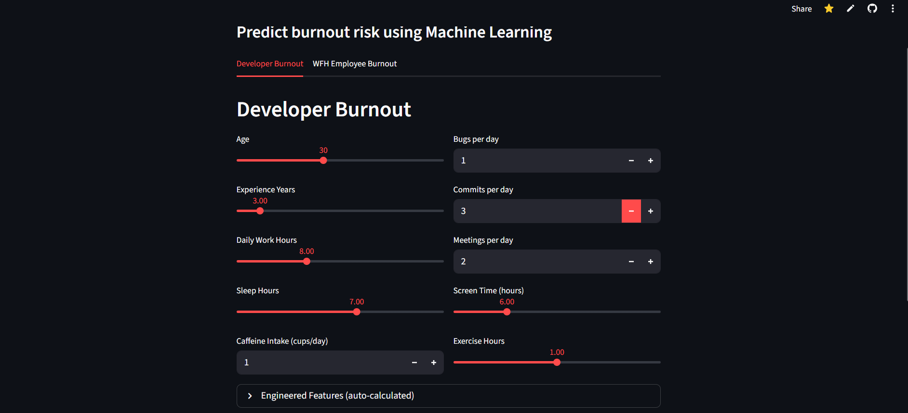

<div align="center">

# 🔥 PulseWatch

**A Hybrid Predictive System for Employee Burnout Prediction**

[](https://pulsewatch.streamlit.app/)

<br/>



</div>

---

## About

PulseWatch predicts employee burnout risk using machine learning. It combines **XGBoost regression** for stress scoring with a **GridSearchCV-tuned Ensemble Voting Classifier** for risk classification (Low / Medium / High).

The interactive Streamlit dashboard supports two prediction modes:

- **Developer Burnout** — uses work hours, bugs, commits, screen time, sleep, and more
- **WFH Employee Burnout** — uses meetings, breaks, after-hours work, task completion rate, and more

Both tabs auto-compute engineered features and display color-coded risk badges with actionable feedback.

**👉 [Try it live →](https://pulsewatch.streamlit.app/)**

---

## Quick Start

```bash
git clone https://github.com/MithunKumarRajak/PulseWatch.git
cd PulseWatch
pip install -r requirements.txt
streamlit run app.py
```

---

## Tech Stack

**Frontend:** Streamlit · **ML:** XGBoost, Ensemble Voting (LR + ExtraTrees + SVC), CatBoost · **Preprocessing:** scikit-learn · **Deployment:** Streamlit Cloud

---

## Deployment

The app is live at **[pulsewatch.streamlit.app](https://pulsewatch.streamlit.app/)**

To deploy your own: push to GitHub → connect at [share.streamlit.io](https://share.streamlit.io) → set main file to `app.py` → deploy.

---

## Author

**Mithun Kumar Rajak** — [@MithunKumarRajak](https://github.com/MithunKumarRajak)

---

## License

Educational and demonstration purposes.
